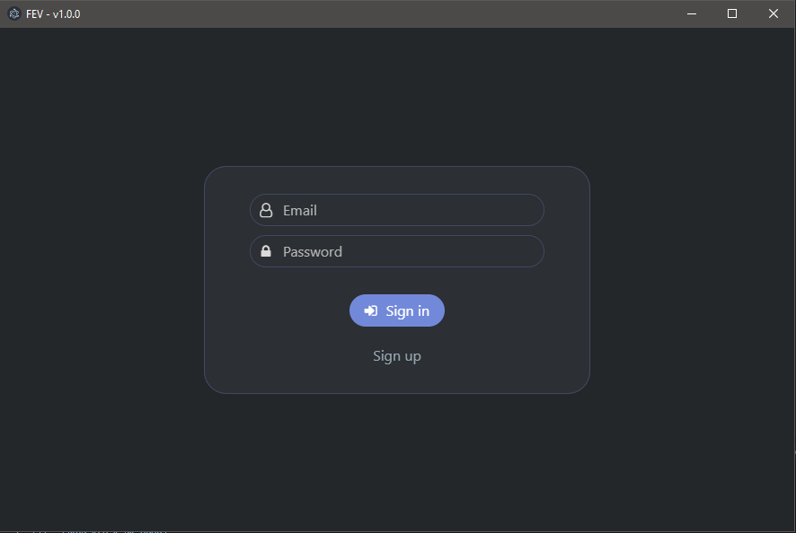
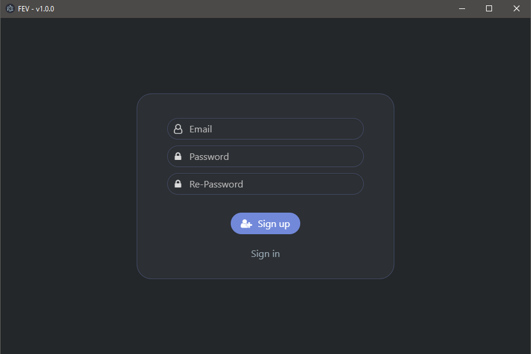
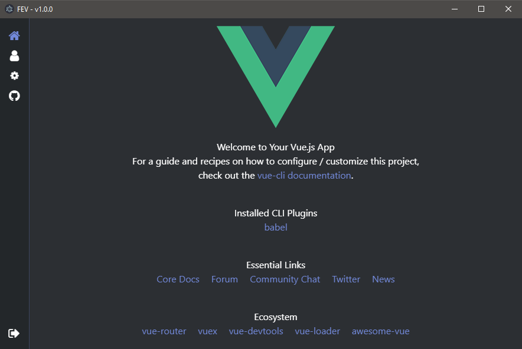

# Firebase-Electron-Vue
Simple authentication system with Firebase using [Electron](https://github.com/electron/electron) and [Vue](https://github.com/vuejs/vue).

---

## Installation 
```bash
$ git clone https://github.com/burak-olmez/Firebase-Electron-Vue.git
$ cd Firebase-Electron-Vue
$ npm install
$ npm run electron:serve
```

---

## Screenshots




---

## License
[The MIT License (MIT)](./LICENSE)
